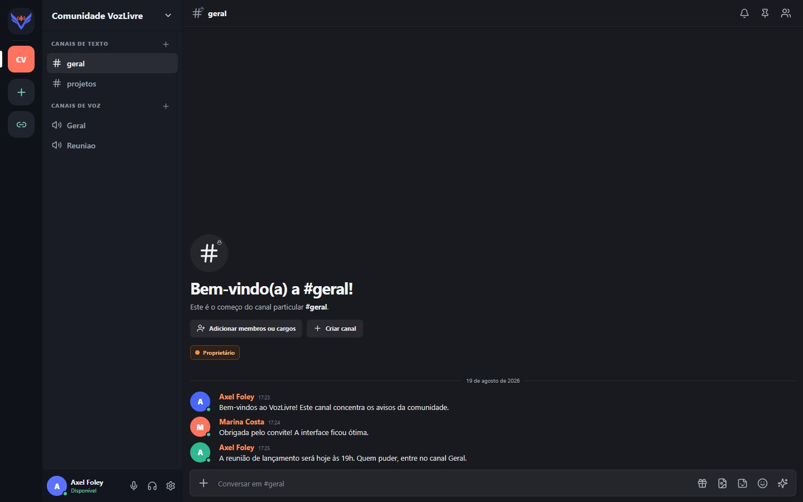
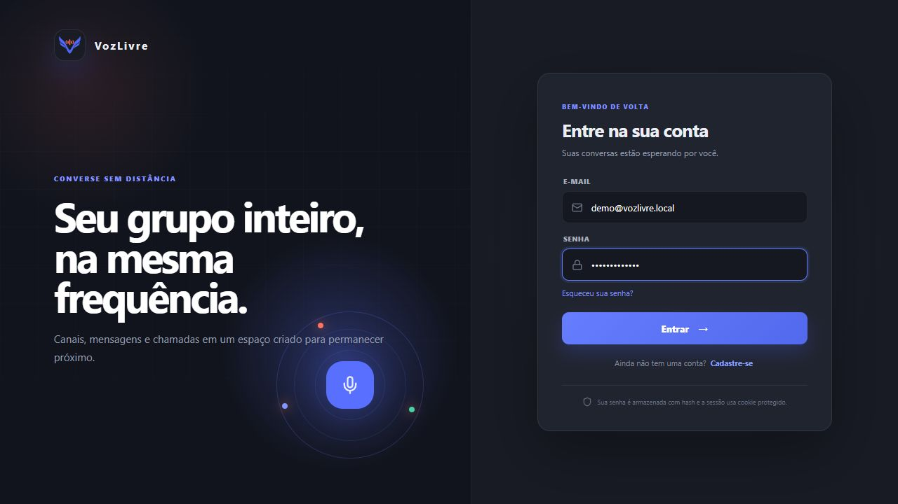
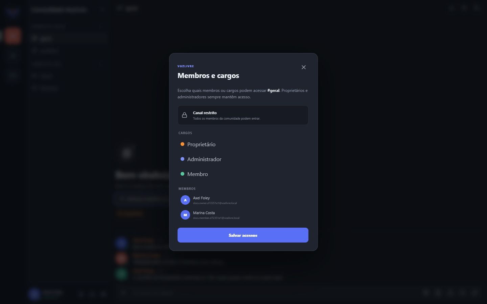
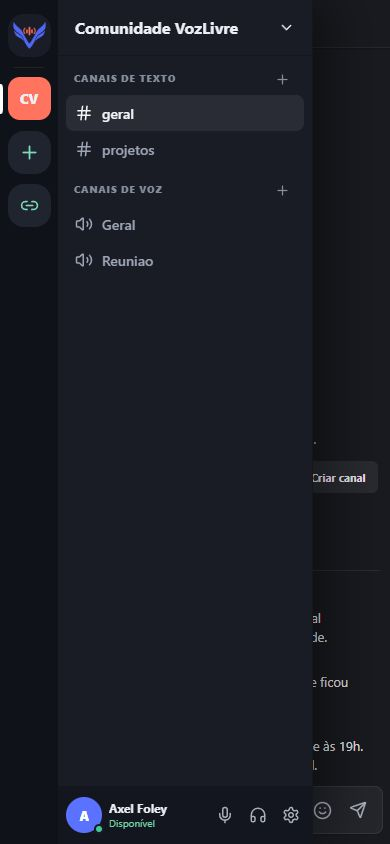

<p align="center">
  
</p>

<h1 align="center">VozLivre</h1>

<p align="center">
  Comunidades, mensagens e chamadas em tempo real em uma plataforma aberta e independente.
</p>

<p align="center">
  <a href="https://github.com/axelfvm/vozlivre/actions/workflows/ci.yml"></a>
  <a href="LICENSE"></a>
  
  
</p>

O VozLivre é uma plataforma original de comunicação inspirada no modelo mental de comunidades como o Discord. Ela reúne espaços privados, canais de texto e voz, mensagens persistentes, convites, presença em tempo real, vídeo e compartilhamento de tela.

## Visão geral



<table>
  <tr>
    <td width="50%"></td>
    <td width="50%"></td>
  </tr>
  <tr>
    <td align="center"><strong>Login e registro</strong></td>
    <td align="center"><strong>Permissões por membros e cargos</strong></td>
  </tr>
</table>

<p align="center">
  
  <br />
  <strong>Navegação responsiva</strong>
</p>

## Funcionalidades

- Cadastro e login com e-mail e senha.
- Senhas protegidas com bcrypt e sessão em cookie `HttpOnly`.
- Apenas uma sessão ativa por conta; um novo login invalida a conexão anterior.
- Autenticação em duas etapas TOTP com códigos de recuperação, sem provedor externo.
- Perfil, avatar local, senha, privacidade, notificações, aparência e dispositivos persistentes.
- Criação manual de comunidades — nenhuma comunidade falsa acompanha a conta.
- Entrada em comunidades privadas somente por convite.
- Convites com expiração, limite de usos, cópia e revogação.
- Categorias ordenáveis e criação de canais de texto, voz e threads.
- Restrição de canais por membro e por cargos personalizados.
- Amigos, solicitações, bloqueio, mensagens diretas e grupos privados de até 25 pessoas.
- Mensagens armazenadas no PostgreSQL e restauradas ao abrir o canal.
- Busca de mensagens, respostas, edição, exclusão, reações, menções e mensagens fixadas.
- Anexos persistentes de até 25 MB com preview de imagem, vídeo e áudio.
- Figurinhas próprias por comunidade e Markdown renderizado de forma segura.
- Busca, tendências e envio de GIFs pelo GIPHY, com atribuição ao provedor e ao criador.
- Contadores de mensagens não lidas e indicador de digitação em tempo real.
- Chat em tempo real com Socket.IO e adapter Redis para múltiplas réplicas.
- Presença de voz sincronizada apenas para membros autorizados no canal.
- Áudio, vídeo e compartilhamento de tela com LiveKit/WebRTC.
- Controles de microfone, ensurdecimento, câmera, tela e desconexão.
- Preferências persistentes de dispositivos, volume, qualidade de tela, notificações e aparência.
- Cargos personalizados com permissões efetivas para canais, membros, mensagens, convites e mídia.
- Moderação com timeout, banimento, desbanimento e registro de auditoria.
- Lista de membros, saída voluntária, transferência de propriedade e exclusão de comunidades e grupos.
- Interface desktop e mobile baseada na experiência de comunidades por canais.

## Arquitetura

| Componente | Tecnologia | Responsabilidade |
| --- | --- | --- |
| Interface | React 19, TypeScript e Vite | Autenticação, comunidades, chat e controles de mídia |
| API | NestJS 11 | Regras de negócio, autenticação, autorização e tokens de mídia |
| Realtime | Socket.IO + adapter Redis | Mensagens, invalidação de sessão e presença de voz distribuída |
| Banco | PostgreSQL + Prisma | Usuários, sessões, espaços, convites, canais, acessos e mensagens |
| Arquivos | Volume persistente local | Avatares, ícones, figurinhas e anexos validados e associados às entidades |
| Mídia | LiveKit | SFU WebRTC para áudio, vídeo e compartilhamento de tela |
| GIFs | GIPHY API | Busca e tendências consultadas diretamente pelo navegador; a mensagem selecionada é validada e persistida pela API |
| Coordenação | Redis | Pub/sub do Socket.IO e coordenação entre réplicas da API |
| Produção | Docker + Nginx | Build reproduzível, frontend estático e proxy de API/WebSocket |

O tráfego do chat não passa pelo servidor de mídia. O navegador solicita ao backend um token LiveKit curto e limitado à sala autorizada; a chave secreta nunca é enviada ao cliente.

## Estrutura do projeto

```text
.
├── apps/
│   ├── api/                 # NestJS, Prisma, Socket.IO e LiveKit Server SDK
│   │   ├── prisma/          # Schema e migrations versionadas
│   │   └── src/             # Controllers, services, guards e gateway
│   └── web/                 # React, Vite e componentes LiveKit
├── docs/screenshots/        # Imagens utilizadas nesta documentação
├── infra/livekit.yaml       # Configuração local do LiveKit
├── docker-compose.yml       # Infraestrutura de desenvolvimento
└── docker-compose.production.yml
```

## Requisitos

- Node.js 24 ou superior.
- pnpm 11.
- Docker com Docker Compose.
- Portas locais `3000`, `5173`, `55432`, `6379`, `7880`, `7881` e `50000-50100/udp` disponíveis.

## Executar localmente

```bash
git clone https://github.com/axelfvm/vozlivre.git
cd vozlivre
cp .env.example .env
pnpm install
pnpm infra:up
pnpm --filter api exec prisma migrate deploy
pnpm dev
```

Acesse `http://localhost:5173`. A API fica disponível em `http://localhost:3000` e o healthcheck em `http://localhost:3000/health`.

Para encerrar somente a infraestrutura local:

```bash
pnpm infra:down
```

## Variáveis de ambiente

| Variável | Uso |
| --- | --- |
| `NODE_ENV` | `development`, `test` ou `production` |
| `PORT` | Porta HTTP da API |
| `WEB_ORIGIN` | Origens permitidas, separadas por vírgula |
| `DATABASE_URL` | Conexão PostgreSQL |
| `REDIS_URL` | Conexão Redis |
| `LIVEKIT_URL` | Endpoint LiveKit utilizado pelo backend |
| `VITE_LIVEKIT_URL` | Endpoint público LiveKit incorporado ao frontend |
| `VITE_GIPHY_API_KEY` | Chave pública de cliente usada pelo seletor de GIFs no navegador |
| `LIVEKIT_API_KEY` | Chave privada do backend para emitir tokens |
| `LIVEKIT_API_SECRET` | Segredo privado do backend para emitir tokens |
| `JWT_SECRET` | Segredo das sessões da aplicação |
| `TRUST_PROXY` | Habilita confiança no primeiro proxy reverso |

Use `.env.example` para desenvolvimento e `.env.production.example` como checklist de produção. Variáveis `VITE_*` são incorporadas ao bundle e nunca devem conter segredos.

### Configurar GIFs

1. Crie uma aplicação no [painel de desenvolvedores do GIPHY](https://developers.giphy.com/dashboard/).
2. Copie a chave da API para `VITE_GIPHY_API_KEY` no arquivo `.env`.
3. Reinicie o frontend após alterar a variável.

As consultas de busca e tendências são feitas diretamente pelo navegador, conforme a [documentação da GIPHY API](https://developers.giphy.com/docs/api/). A chave `VITE_GIPHY_API_KEY` fica visível no bundle e deve ser tratada como configuração pública de cliente, nunca como segredo. Sem essa chave, o restante do VozLivre continua funcionando e o seletor informa como concluir a configuração.

## Comandos de qualidade

```bash
pnpm lint       # ESLint da API e oxlint do frontend
pnpm test       # Testes unitários
pnpm test:e2e   # Testes HTTP com banco
pnpm build      # Builds de produção da API e do frontend
pnpm check      # Lint + testes + E2E + builds
pnpm audit      # Auditoria de dependências
```

O workflow em `.github/workflows/ci.yml` executa migrations e todas essas validações automaticamente em pushes e pull requests.

## Produção

O repositório inclui imagens separadas para API e frontend, Nginx com proxy WebSocket, healthcheck do PostgreSQL e validação estrita de configurações sensíveis.

1. Copie `.env.production.example` para `.env.production`.
2. Substitua todos os valores `CHANGE_ME`.
3. Configure `WEB_ORIGIN` com HTTPS e LiveKit com WSS.
4. Disponibilize PostgreSQL, Redis e uma implantação de produção do LiveKit.
5. Aplique as migrations:

   ```bash
   docker compose --env-file .env.production -f docker-compose.production.yml run --rm api pnpm --filter api exec prisma migrate deploy
   ```

6. Construa e suba os serviços:

   ```bash
   docker compose --env-file .env.production -f docker-compose.production.yml up -d --build
   ```

7. Publique a porta `8080` atrás de um proxy ou load balancer TLS e valide `https://seu-dominio/health`.

O backend recusa a inicialização quando produção usa placeholders, segredos de desenvolvimento, origem sem HTTPS ou LiveKit sem WSS.

O Compose de produção mantém os arquivos no volume `vozlivre_uploads`. O adapter Redis distribui eventos, invalidação de sessão e presença de voz entre réplicas da API. Réplicas no mesmo host devem montar o mesmo volume; uma implantação em vários hosts precisa trocar esse volume por armazenamento compartilhado ou object storage.

Para LiveKit self-hosted, configure domínio, certificado TLS válido, TURN, Redis e as portas públicas WebRTC conforme a infraestrutura escolhida. O `docker-compose.yml` da raiz é somente para desenvolvimento local.

## Segurança

- CORS HTTP e WebSocket limitado às origens configuradas.
- Proteção contra CSRF para requisições autenticadas que alteram estado.
- Headers HTTP de segurança com Helmet e Nginx.
- Rate limit global e limite mais restrito para login e registro.
- DTOs validados e propriedades desconhecidas rejeitadas.
- Autorização de comunidade e canal verificada no backend.
- Permissões de publicação de áudio, vídeo e tela incorporadas ao token LiveKit.
- Tokens LiveKit de curta duração e limitados a uma única sala.
- Uploads com allowlist de MIME, extensão derivada pelo servidor e assinatura binária validada para imagens.
- Bloqueios sociais impedem novas mensagens nos dois sentidos.
- Segredos e arquivos `.env` excluídos do Git.

## Integrações externas não incluídas

O núcleo local do VozLivre funciona sem SaaS de terceiros. Permanecem intencionalmente fora do projeto os recursos que exigem contratar ou integrar outro serviço:

- recuperação de senha e confirmação de e-mail por envio transacional;
- geração externa de preview de links;
- push notification fora do navegador;
- CDN ou object storage para uma implantação distribuída em vários hosts.

LiveKit, PostgreSQL e Redis possuem configuração self-hosted no projeto e não dependem de uma conta em provedor externo durante o desenvolvimento local.

## Contribuindo

Issues e pull requests são bem-vindos. Antes de enviar uma alteração:

1. Crie uma branch específica.
2. Execute `pnpm check`.
3. Execute `pnpm audit`.
4. Inclua migration e testes quando alterar persistência ou autorização.
5. Atualize a documentação quando mudar contratos ou variáveis de ambiente.

## Créditos e licença

VozLivre foi criado por [Axel Foley](https://github.com/axelfvm).

O projeto utiliza software e serviços de terceiros, cada um preservando seus próprios autores, marcas e termos de licença:

| Área | Projetos creditados |
| --- | --- |
| Runtime e linguagem | [Node.js](https://nodejs.org/), [TypeScript](https://www.typescriptlang.org/) e [pnpm](https://pnpm.io/) |
| Interface | [React](https://react.dev/), [Vite](https://vite.dev/) e [Lucide](https://lucide.dev/) |
| Backend e persistência | [NestJS](https://nestjs.com/), [Prisma](https://www.prisma.io/), [PostgreSQL](https://www.postgresql.org/) e [Redis](https://redis.io/) |
| Tempo real e mídia | [Socket.IO](https://socket.io/) e [LiveKit](https://livekit.io/) |
| GIFs | [GIPHY](https://giphy.com/) — conteúdo, marcas e serviço sujeitos aos [Termos da GIPHY API](https://support.giphy.com/hc/en-us/articles/360028134111-GIPHY-API-Terms-of-Service) |
| Segurança e utilitários | [bcrypt.js](https://github.com/dcodeIO/bcrypt.js), [Helmet](https://helmetjs.github.io/), [class-validator](https://github.com/typestack/class-validator), [class-transformer](https://github.com/typestack/class-transformer), [Joi](https://joi.dev/), [Multer](https://github.com/expressjs/multer), [cookie-parser](https://github.com/expressjs/cookie-parser), [RxJS](https://rxjs.dev/) e [reflect-metadata](https://github.com/rbuckton/reflect-metadata) |
| Infraestrutura | [Docker](https://www.docker.com/) e [Nginx](https://nginx.org/) |
| Qualidade e testes | [Jest](https://jestjs.io/), [Supertest](https://github.com/forwardemail/supertest), [ESLint](https://eslint.org/), [Prettier](https://prettier.io/) e [Oxlint](https://oxc.rs/docs/guide/usage/linter.html) |

O selo `Powered by GIPHY` distribuído pelo próprio GIPHY está em `apps/web/public/powered-by-giphy.png` e é exibido permanentemente no seletor. A autoria do GIF também é mostrada quando o provedor retorna essa informação. O uso dessas marcas não indica patrocínio ou endosso ao VozLivre.

A relação completa e as versões exatas das dependências estão em `package.json`, `apps/api/package.json`, `apps/web/package.json` e `pnpm-lock.yaml`. As dependências não são relicenciadas pela licença do VozLivre; consulte a licença de cada projeto nos links oficiais e nos respectivos pacotes.

O código é aberto sob a licença [BSD 3-Clause](LICENSE). Uso, modificação e redistribuição são permitidos, inclusive em projetos derivados, desde que o aviso de copyright, as condições da licença e os créditos ao autor sejam mantidos conforme o arquivo `LICENSE`.
